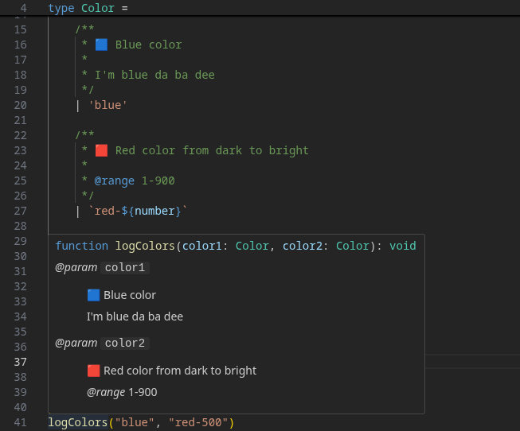

# 🟦 TypeScript Union Docs Plugin

A TypeScript Language Service plugin that displays JSDoc comments from union type members directly in your editor's quick info (hover) tooltips.

<p align="center">
	
</p>

### 💡 The Problem

By default, when you use a value from a union type, TypeScript's quick info just shows the literal value or the base union type. Documentation associated with that specific member of the union is ignored.

### ✨ The Solution

This plugin resolves the union member back to its original definition, pulling its JSDoc documentation directly into the tooltip.

**After installing this plugin**, hovering over a function now shows its full documentation.

## 🚀 Get Started

### 1\. Installation

Install typescript and the plugin as a development dependency in your project (in this example by npm):

```bash
npm install --save-dev typescript github:serveny/ts-union-docs-plugin
```

### 2\. Configuration

Enable the plugin in your `tsconfig.json` file:

> [!IMPORTANT]  
> The plugins list must be defined inside `compilerOptions`, because it's a **Language Service Plugin**

```json
{
	"compilerOptions": {
		// ... your other options
		"plugins": [
			{
				"name": "ts-union-docs-plugin"
			}
		]
	}
}
```

### 3\. Select workspace typescript version

For the plugin to work you need to select the typescript from your workspace.

**For VS Code:** Open any TS file, then open VS Code Command Palette (`Cmd+Shift+P` or `Ctrl+Shift+P`), run the **"TypeScript: Select Typescript version..."** command and select `Use workspace version`.

### 4\. Restart TS server (or IDE)

After updating your `tsconfig.json`, you **must restart your TS Server**.

**For VS Code:** Open VS Code Command Palette (`Cmd+Shift+P` or `Ctrl+Shift+P`) and run the `TypeScript: Restart TS server` command.

## 📋 Features

- **Function Union Parameters Documentation:** When hovering over a a function.
- **Documentation for Variables with Union Type:** When hovering over a `const`, `let` or `var` that is assigned a union member.

## 🗺️ Roadmap

- **Dynamic Type Suggestions:** Provide intelligent suggestions for template literal types (e.g., typing `group${number}` would suggest `group0`, `group1`, etc.).
- **Deprecation warnings** for union type entries

## 🛠️ Contributing & Development

Interested in helping build this plugin? We'd love to have you\!

### 🤖 Automatic Testing

- **Run Tests:** Execute this command to verify plugin functionality:
  ```bash
  npm run test
  ```
- **File Structure:** All test logic is located in the `tests` directory, while the source code being tested resides in `tests/cases`.
- **Adding Tests:** To create a new test, add a `your-test.test.ts` file to the tests folder. Then, either create a corresponding file in `tests/cases` or extend an existing case if it covers the same functional area.

### 🥵 How to Debug

Run a debug instance of VS Code that loads your local plugin code. The commands search the example project under `../example` (outside of plugin project folder)

> [!IMPORTANT]  
> The project to be debugged must be located outside the ts-union-docs-plugin folder. It wont work otherwise. If you want to use the example project, you must copy or move it out of the folder.

> [!IMPORTANT]  
> [TS Union Docs VSCode extension](https://github.com/Serveny/ts-union-docs-vscode-extension) should not be installed in the debug instance, because then debugging will not work (It can't find the breakpoints)

1. **Start watcher in plugin project folder:**  
   This command builds the plugin and installs it in example project every time a file inside the plugin project was changed.

   ```bash
   npm run watch-and-refresh
   ```

2. **Start the example project with debugging enabled:**  
   This command launches VS Code (`code`) using a special `TSS_DEBUG` port and a separate user data directory to avoid conflicts.
   ```bash
   npm run debug
   ```

---

## 📄 License

This project is licensed under the **MIT License**. See the [LICENSE](https://www.google.com/search?q=LICENSE) file for details.
